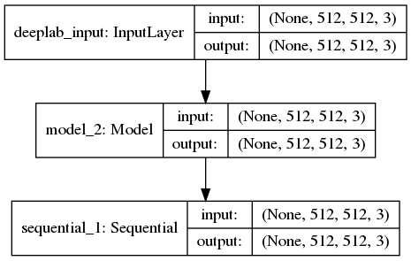
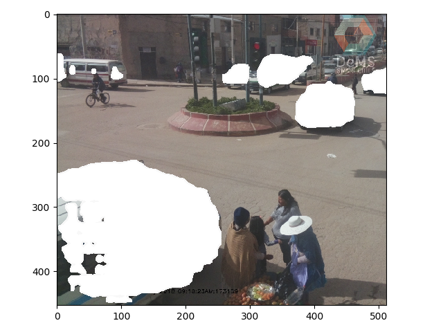
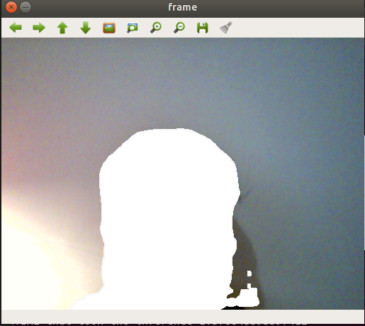

# Object Removal Keras

The general idea is to use the mask generade by Object Segmentation model like DeepLabv3+ for the Object Removal task, for accomplish this we use three Networks, [DeepLabv3+(mobilenetsV2 backbone)](https://github.com/stanlee321/object-removal-tensorflow/tree/master/deeplab3) + [customlayer](https://github.com/stanlee321/object-removal-tensorflow/blob/master/model.py) + [glcic](https://github.com/stanlee321/object-removal-tensorflow/tree/master/inpainting).

The first network computes the `mask segmentations` the second insert the holes in the image  and the thrid fills the white hole using a [GAN](https://github.com/stanlee321/object-removal-tensorflow/tree/master/inpainting) .

WORK still in progress, we have two choises for fill the white holes.

* Fill the white holes with the [GAN](https://github.com/stanlee321/object-removal-tensorflow/tree/master/inpainting).

* If we are going to use a static camera, we can grab a background frame for fill the white holes.

The main model is `model.py` this combines DeepLabv3+  and the custom Layer.
<div style="text-align:center"></div>

The deeplabv3+ model is into the `./deeplab3` folder and the GAN is into the `./inpainting` folder.

### How to use it.

The output of the main network in `model.py` is `(batch_size, height, width, num_classes)`. 

#### For test image

Run the script `test.py` in the root of the folder, this will process the image ` ./deeplab3/imgs/image1.jpg` and will output:

<div style="text-align:center"></div>

#### For test with video

Run the script `test_video.py` in the root of the folder, this will use the `src = 0` of your computer as the video input, with the next output:


```console

(venv-cv) stanlee321:~/Desktop/DNN/object_removal$ python test_video.py 
Using TensorFlow backend.
TIME that took the inference 4.005507707595825
TIME that took the inference 1.6751325130462646
TIME that took the inference 1.6122970581054688
TIME that took the inference 1.622474193572998
TIME that took the inference 1.6862339973449707
TIME that took the inference 1.6034736633300781
TIME that took the inference 1.6270244121551514
...
...
...

```

<div style="text-align:center"></div>

Tested on Ubuntu 18.04 Intel Corei3 laptop computer.

#### Change removed object:

In the Pascal VOC dataset for segmentation there are the next categories:

```JSON
"""
{
    0: 'background',
    1: 'aeroplane',
    2: 'bicycle',
    3: 'bird',
    4: 'boat',
    5: 'bottle',
    6: 'bus',
    7: 'car',
    8: 'cat',
    9: 'chair',
    10: 'cow',
    11: 'diningtable',
    12: 'dog',
    13: 'horse',
    14: 'motorbike',
    15: 'person',
    16: 'potted-plant',
    17: 'sheep',
    18: 'sofa',
    19: 'train',
    20: 'tv/monitor',
    255: 'ambigious'
}
"""
```

You can change the category number in `test.py` or `test_video.py` in the `main()` function, with one from the Pascal VOC classes, in `test.py` is  used the `7` category, which is the `car` class, in `test_video.py` is used the `15` category for the `person` class.


```python

# test.py
...
...

def main(url):
    category = 7
    deeplab_model = DeepModel(obj=category)

    image, resized_im, _ = read_image(url)
    
    deeplab_model.mask_model.create_mask_tool.image = image
    model = deeplab_model.forward()
    seg_map = model.predict(np.expand_dims(resized_im, 0))
    input_mask = seg_map
    array = input_mask.squeeze()
    # Plot
    io.imshow(array)
    io.show()
```


### TODOs
* Train the `inpainting` network with places365 dataset.
* Merge the `intainting` network with the  proposed `model` for fill the white holes.
* Propose a background patch for the white holes if we use static cameras.
## References

* [Fully Convolutional Networks (FCNs) for Image Segmentation](http://warmspringwinds.github.io/tensorflow/tf-slim/2017/01/23/fully-convolutional-networks-(fcns)-for-image-segmentation/)

* [Keras Functional API](https://keras.io/getting-started/functional-api-guide/)
* [how-to-execute-a-complicated-function-inside-keras-lambda-layer-using-tf-py-func](https://stackoverflow.com/questions/53527358/how-to-execute-a-complicated-function-inside-keras-lambda-layer-using-tf-py-func)