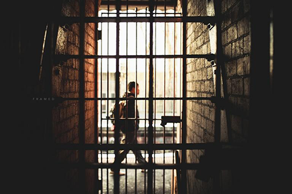
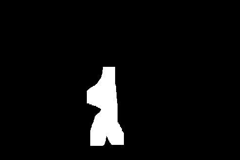
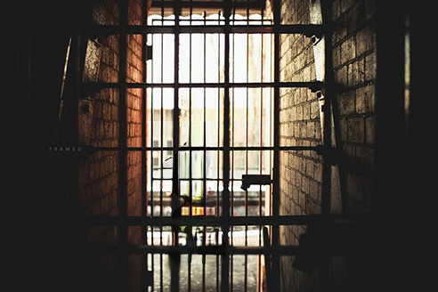

# GLCIC
## Globally and Locally Consistent Image Completion

### Architechture:
<div style="text-align:center"></div>

---
### Dependencies Required:
- Python 3.6
- Keras
- Numpy
- Tensorflow
- OpenCV
---

<div style="text-align:center"></div>
<div style="text-align:center"></div>
<div style="text-align:center"></div>

## Dataset:
### Places Dataset

```
wget http://data.csail.mit.edu/places/places365/test_256.tar
wget http://data.csail.mit.edu/places/places365/val_256.tar
unzip test_256.tar
unzip val_256.tar
```


### TODOs

* Use the `poissonblending` as proposed by `pytorch-siggraph2017-inpainting` for obtain better results.


### References

* [pytorch-siggraph2017-inpainting](https://github.com/akmtn/pytorch-siggraph2017-inpainting)
* [image completion](https://github.com/neka-nat/image_completion_keras)
* [Globally and Locally Consistent Image Completion (GLCIC)](https://github.com/tadax/glcic)